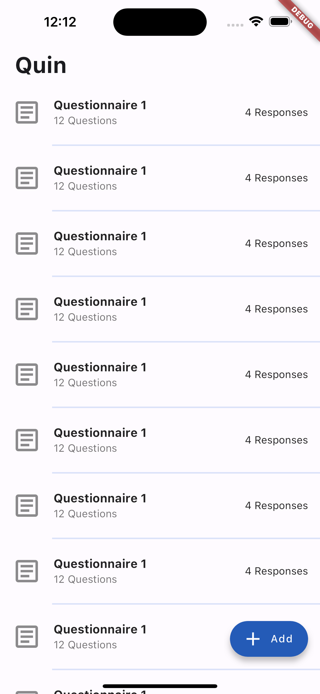
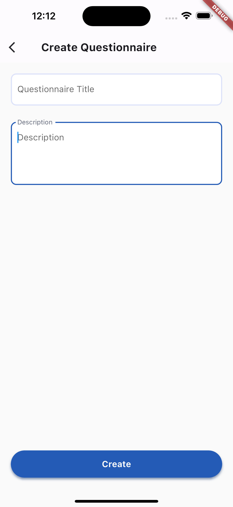
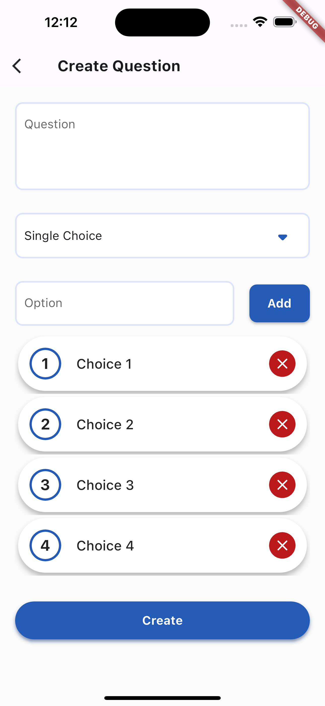
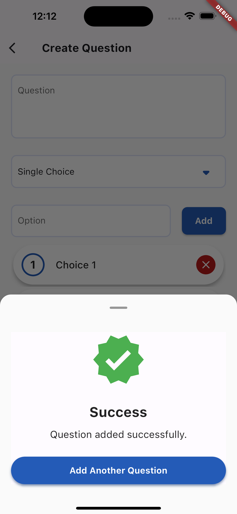

# Quin

A Questionnaire application designed and developed in flutter(Work in progress)

Intructions:
1. Clone project from git
2. Install firebase CLI: https://firebase.google.com/docs/cli
3. Login and test firebase cli
4. setup firestore development enviroment: https://firebase.google.com/docs/firestore/quickstart

<table>
  <tr>
     <td>Start</td>
     <td>Questionnaire List</td>
  </tr>
  <tr>
    <td></td>
    <td></td>
  </tr>
  <tr>
     <td>Create Questionnaire</td>
     <td>Create Question</td>
     <td>Create Question Success</td>
  </tr>
  <tr>
    <td></td>
    <td></td>
    <td></td>
  </tr>
 </table>
